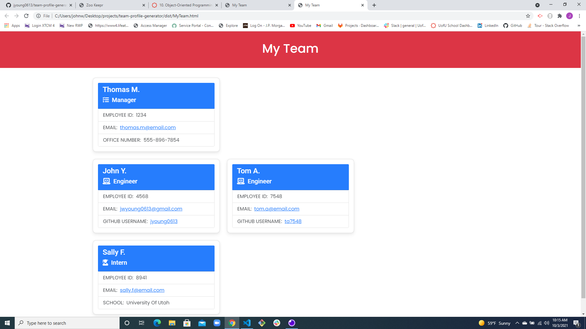

# team-profile-generator

  

  ## Description
  Node.js program to prompt user for information and then build a Profile for their entire team displaying team member details

  ## Table of Contents
  - [Installation](#Installation)
  - [Usage](#Usage)
  - [Contributing](#Contributing)
  - [Tests](#Tests)
  - [License](#License)
  - [Questions](#Questions)

  ## Installation
  * Install node js 
  * Clone code from repo 
  * Open code and type npm i into your command line 
  * Next type node index to initiate the questions

  ## Usage
  Node built program setup to ask users for Employee Team details and then generate a Team Profile page with contact details for your team.
  
  

  ## Contributing
  

  ## Tests
  * Test that you can create an object Employee with name id email address
  * Test that you can generate a name
  * Test that you can generate id
  * Test that you can add email
  * Test the previous items but for the Engineer class
  * Test Engineer github filed works
  * Test the previous items but for the intern class
  * Test that the school field works
  * Test the previous items but for Manager
  * Test Manager phone number field works

  ## License
  This project is licensed under the terms of the following license: **MIT**.

  ## Questions
  GitHub: [jyoung0613](https://github.com/jyoung0613).  

  For inquiries, please contact jwyoung0613@gmail.com.
